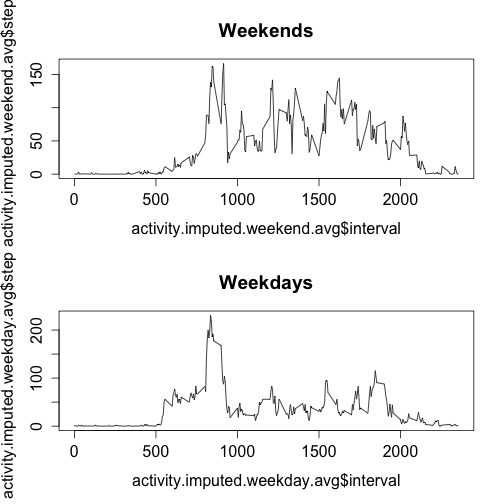

###Set the working directory

```r
setwd("/Users/jwhite/Copy/JHUdatascience/5 Reproducible Research/CourseProject1/RepData_PeerAssessment1")
```

## Loading and preprocessing the data

```r
library(ggplot2)
library(plyr)
library(lubridate)
library(knitr)

fileUrl <- "https://d396qusza40orc.cloudfront.net/repdata%2Fdata%2Factivity.zip"

download.file(fileUrl, destfile="./activity.zip", method="curl")

# unzips the downloaded file, if the file already exists will overwrite
unzip("activity.zip", overwrite=TRUE)

# reads in the csv and puts it in data frame called data
data <- read.csv("activity.csv")

# removes the NAs and stores in new data frame
data.no.na <- na.omit(data)

# gets total number of steps taken per day
steps_taken = ddply(data.no.na, .(date), summarize, steps.taken = sum(steps))
```

## What is mean total number of steps taken per day?

Creates histogram for steps taken

```r
steps_hist <- ggplot(steps_taken, aes(x=steps.taken))
steps_hist + geom_histogram()
```

 

Calculates mean

```r
mean(steps_taken$steps.taken)
```

```
## [1] 10766
```
Calculates median

```r
median(steps_taken$steps.taken)
```

```
## [1] 10765
```
## What is the average daily activity pattern?

```r
avg.daily.activity <- aggregate(.~interval, FUN=mean, data=data)

plot(avg.daily.activity$interval, avg.daily.activity$steps, type="l")
```

 

Get the interval that has the highest amount of steps

```r
subset(avg.daily.activity, steps==max(avg.daily.activity$steps))
```

```
##     interval steps  date
## 104      835 206.2 30.72
```
Interval number 835 is the 5-minute interval with the most steps

## Imputing missing values

This will calculate the total number of NAs.

```r
sum(is.na(data))
```

```
## [1] 2304
```
Strategy for filling in all of the missing values in the dataset.

```r
# technique to replace NA with mean by subset in R and the impute.mean function 
# described at http://stackoverflow.com/a/9322975/3657371
impute.mean <- function(x) replace(x, is.na(x), mean(x, na.rm = TRUE))

# create a new dataset that is equal to the original dataset, but with the 
# missing data filled in
# original dataset is first three variables of the [activity] dataframe
activity.imputed <- plyr::ddply(data[1:3], .(interval), transform,
                                steps = impute.mean(steps),
                                date = date,
                                interval = interval)
# sort by date and interval
activity.imputed <- activity.imputed[order(activity.imputed$date,
                                           activity.imputed$interval),]

# renumber rownames
row.names(activity.imputed) <- 1:nrow(activity.imputed)
```


```r
steps_taken_imputed = ddply(activity.imputed, .(date), summarize, steps.taken.imputed = sum(steps))

steps_imputed <- ggplot(steps_taken_imputed, aes(x=steps.taken.imputed))
steps_imputed + geom_histogram()
```

 


```r
mean(steps_taken_imputed$steps.taken.imputed)
```

```
## [1] 10766
```

```r
median(steps_taken_imputed$steps.taken.imputed)
```

```
## [1] 10766
```

For the most part it doesn't seem the values differ from the previous estimates for mean and median. Nor was there a significant impact by replacing the NAs with the means.

## Are there differences in activity patterns between weekdays and weekends?

```r
activity.imputed["day.of.week"] <- wday(as.Date(activity.imputed$date))

activity.imputed.weekday <- subset(activity.imputed, activity.imputed$day.of.week == 2 | activity.imputed$day.of.week == 3 | activity.imputed$day.of.week == 4 | activity.imputed$day.of.week == 5 | activity.imputed$day.of.week == 6 )
activity.imputed.weekend <- subset(activity.imputed, activity.imputed$day.of.week == 1 | activity.imputed$day.of.week == 7)

activity.imputed.weekday.avg <- aggregate(.~interval, FUN=mean, data=activity.imputed.weekday)
activity.imputed.weekend.avg <- aggregate(.~interval, FUN=mean, data=activity.imputed.weekend)

par(mfrow=c(2,1)) 
plot(activity.imputed.weekend.avg$interval, activity.imputed.weekend.avg$steps, type="l")
title(main="Weekends")
plot(activity.imputed.weekday.avg$interval, activity.imputed.weekday.avg$steps, type="l")
title(main="Weekdays")
```

 


```
## 
## 
## processing file: PA1_template.Rmd
```

```
## 
  |                                                                       
  |                                                                 |   0%
  |                                                                       
  |..                                                               |   4%
##   ordinary text without R code
## 
## 
  |                                                                       
  |.....                                                            |   8%
## label: unnamed-chunk-14
## 
  |                                                                       
  |........                                                         |  12%
##   ordinary text without R code
## 
## 
  |                                                                       
  |..........                                                       |  15%
## label: unnamed-chunk-15 (with options) 
## List of 2
##  $ message: logi FALSE
##  $ warning: logi FALSE
## 
## 
  |                                                                       
  |............                                                     |  19%
##   ordinary text without R code
## 
## 
  |                                                                       
  |...............                                                  |  23%
## label: unnamed-chunk-16 (with options) 
## List of 2
##  $ message: logi FALSE
##  $ warning: logi FALSE
```

```
## stat_bin: binwidth defaulted to range/30. Use 'binwidth = x' to adjust this.
```

```
## 
  |                                                                       
  |..................                                               |  27%
##   ordinary text without R code
## 
## 
  |                                                                       
  |....................                                             |  31%
## label: unnamed-chunk-17
## 
  |                                                                       
  |......................                                           |  35%
##   ordinary text without R code
## 
## 
  |                                                                       
  |.........................                                        |  38%
## label: unnamed-chunk-18
## 
  |                                                                       
  |............................                                     |  42%
##   ordinary text without R code
## 
## 
  |                                                                       
  |..............................                                   |  46%
## label: unnamed-chunk-19
```

```
## 
  |                                                                       
  |................................                                 |  50%
##   ordinary text without R code
## 
## 
  |                                                                       
  |...................................                              |  54%
## label: unnamed-chunk-20
## 
  |                                                                       
  |......................................                           |  58%
##   ordinary text without R code
## 
## 
  |                                                                       
  |........................................                         |  62%
## label: unnamed-chunk-21
## 
  |                                                                       
  |..........................................                       |  65%
##   ordinary text without R code
## 
## 
  |                                                                       
  |.............................................                    |  69%
## label: unnamed-chunk-22
## 
  |                                                                       
  |................................................                 |  73%
##   ordinary text without R code
## 
## 
  |                                                                       
  |..................................................               |  77%
## label: unnamed-chunk-23 (with options) 
## List of 2
##  $ message: logi FALSE
##  $ warning: logi FALSE
```

```
## stat_bin: binwidth defaulted to range/30. Use 'binwidth = x' to adjust this.
```

```
## 
  |                                                                       
  |....................................................             |  81%
##   ordinary text without R code
## 
## 
  |                                                                       
  |.......................................................          |  85%
## label: unnamed-chunk-24
## 
  |                                                                       
  |..........................................................       |  88%
##   ordinary text without R code
## 
## 
  |                                                                       
  |............................................................     |  92%
## label: unnamed-chunk-25
```

```
## 
  |                                                                       
  |..............................................................   |  96%
##   ordinary text without R code
## 
## 
  |                                                                       
  |.................................................................| 100%
## label: unnamed-chunk-26 (with options) 
## List of 1
##  $ echo: logi FALSE
```

```
## output file: PA1_template.md
```

 
